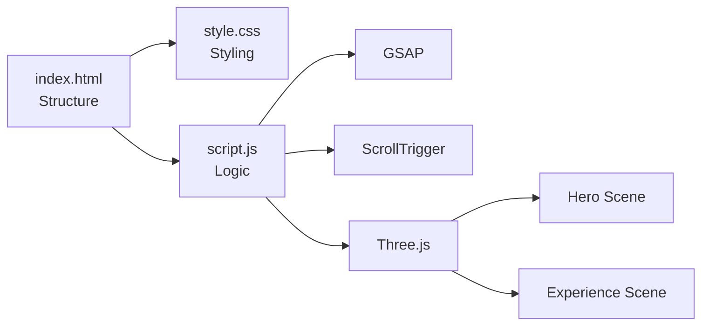
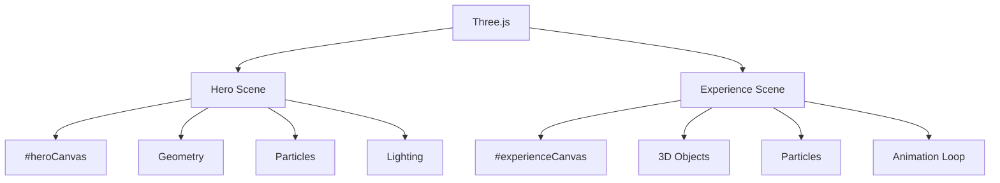
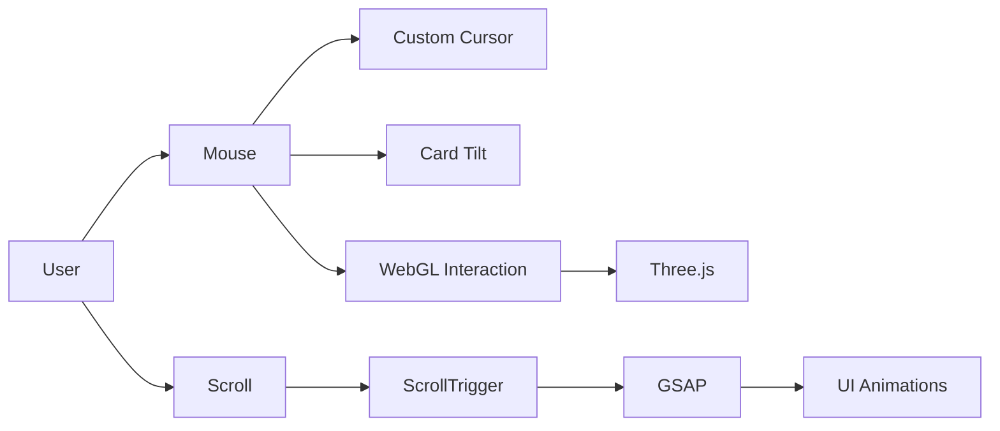

# ◈ NOX — Digital Experience

> A cinematic digital experience built with Vanilla JavaScript, Three.js and GSAP.

<p align="center">
  
  
  
  
  
<br>
  Link : https://rahulnavik375-droid.github.io/nox-website/
</p>

---

## ✦ Overview

NOX is a modern experimental website focused on **creative development, WebGL and motion design**.

The project uses a lightweight frontend stack without any framework or build system.

### ✨ Highlights

* 🌌 Interactive Three.js scenes
* 🎬 GSAP animations & ScrollTrigger
* 🖱️ Custom cursor interactions
* 🧲 Magnetic / tilt interactions
* 📱 Responsive navigation
* 🎨 Custom dark visual system
* ⚡ Lightweight static architecture

---

## 📁 File System

```text
nox-website/
│
├── index.html
├── style.css
├── script.js
└── README.md
```

### File Responsibilities

| File         | Purpose                               |
| ------------ | ------------------------------------- |
| `index.html` | Page structure and content            |
| `style.css`  | Styling, layout and responsive design |
| `script.js`  | Interactions, animations and WebGL    |
| `README.md`  | Project documentation                 |

---

## 🧠 Architecture

The project follows a simple **HTML → CSS → JavaScript** architecture.



### `index.html`

Responsible for:

```text
HTML
│
├── Navigation
├── Hero
│   └── WebGL Canvas
├── About
├── Experience
│   └── WebGL Canvas
├── Services
├── Selected Work
├── Contact
└── Footer
```

### `style.css`

Handles the complete visual layer:

```text
CSS
│
├── Colors & Variables
├── Typography
├── Layout
├── Components
├── Animations
├── WebGL Canvas Styling
└── Responsive Design
```

### `script.js`

Acts as the main application layer:

```text
JavaScript
│
├── Loader
├── Navigation
├── Custom Cursor
├── Card Interactions
├── GSAP Animations
├── ScrollTrigger
├── Hero WebGL Scene
├── Experience WebGL Scene
└── Contact Interaction
```

---

## 🌌 WebGL Architecture

NOX uses **Two Three.js scenes**.



### Hero Scene

The hero canvas contains the primary 3D visual experience with:

* Geometric objects
* Particles
* Lighting
* Continuous animation
* Mouse interaction

### Experience Scene

The second canvas creates a separate interactive 3D environment controlled through animation and scrolling.

---

## 🎬 Animation Flow

GSAP handles UI animation while Three.js handles the WebGL animation.



---

## 🛠 Tech Stack

* **HTML5** — Structure
* **CSS3** — Styling & responsive layout
* **JavaScript** — Application logic
* **Three.js** — 3D / WebGL
* **GSAP** — Animations
* **ScrollTrigger** — Scroll-based animations

---

## 🚀 Getting Started

Clone the repository:

```bash
git clone https://github.com/rahulnavik375-droid/nox-website.git
cd nox-website
```

Run it with any local server.

For example:

```bash
python -m http.server 5500
```

Then open:

```text
http://localhost:5500
```

Or simply open `index.html` directly in your browser.

---


<p align="center"> Build the future. Make it feel alive. </p>
